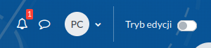
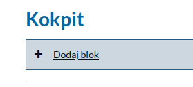
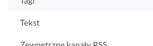
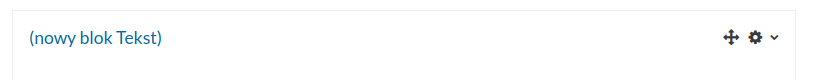
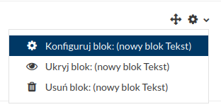
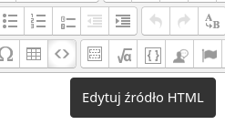
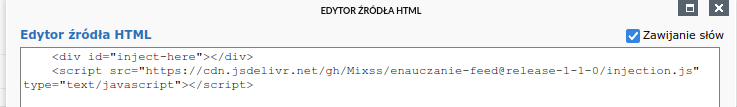
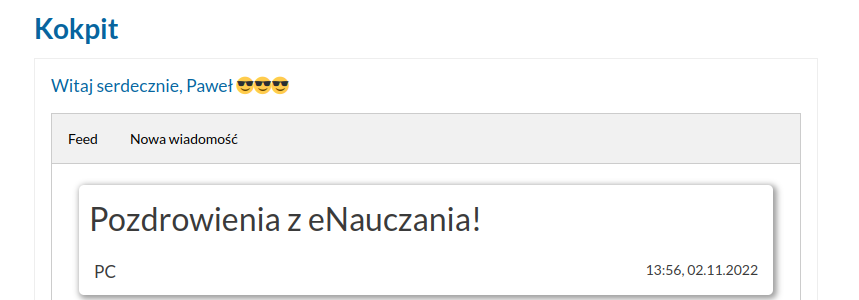

# eNauczanie Feed

Modify your eNauczanie dashboard to communicate with others!

## Table of concepts

- [eNauczanie Feed](#enauczanie-feed)
  - [Table of concepts](#table-of-concepts)
  - [Description](#description)
  - [Installation steps](#installation-steps)
    - [*🇵🇱* Polish](#-polish)
    - [*🇬🇧* English](#-english)

## Description

This app utilizes the ability to create custom blocks in the dashboard, allowing
even JS injections

## Installation steps

### *🇵🇱* Polish

1. Włącz tryb edycji w kokpicie.
   
   
2. Dodaj nowy blok
   
   
3. Wybierz opcję `Tekst`, nowy blok powinien pojawić się na samym dole poniżej wszystkich istniejących bloków.
   
   
4. Przytrzymując znak plusa, przeciągnij nowy blok na samą górę
   
   
5. Kliknij koło zębate, następnie `Konfiguruj blok`
   
   
6. W tytule możesz wpisać dowolną treść.
   
7. W sekcji `Zawartość` kliknij przycisk `Edytuj źródło HTML` (symbol `<>`)
   
   
8. W nowym oknie wklej:
   ```
   <div id="inject-here"></div>
   <script src="https://cdn.jsdelivr.net/gh/Mixss/enauczanie-feed@release-1-1-0/injection.js" type="text/javascript"></script>
   ```
   

9.  Aktualizuj, a następnie zapisz zmiany.
10. Sprawdź działanie wchodząc na Twój kokpit w eNauczaniu!

    

### *🇬🇧* English

1. Turn on editing mode in Dashboard.
2. Add a new block.
3. Select option `Text`, the block should appear below all other existing
blocks.
4. Holding the plus sign, move the new block to the top of the site.
5. Click the cog sign, then `Configure block`.
6. You can type in anything in the title section.
7. In the contents section, click `Edit HTML source` (`<>` symbol). 
8. Paste this code in the pop-up window:
   ```
   <div id="inject-here"></div>
   <script src="https://cdn.jsdelivr.net/gh/Mixss/enauczanie-feed@release-1-1-0/injection.js"type="text/javascript"></script>
   ```
9. Update, then save changes.
10. Try it out by going to the dashboard on eNauczanie!
